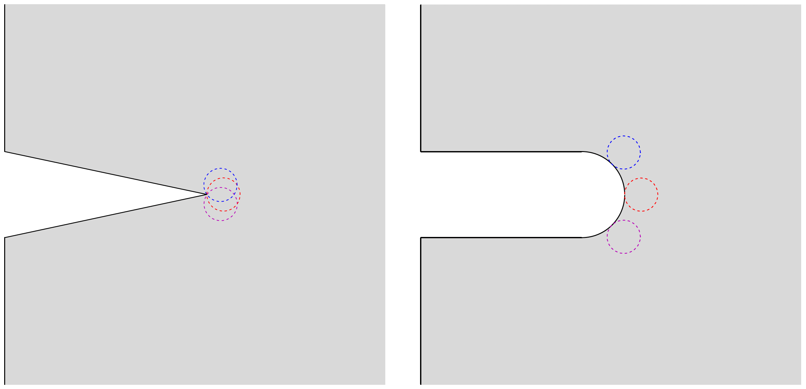
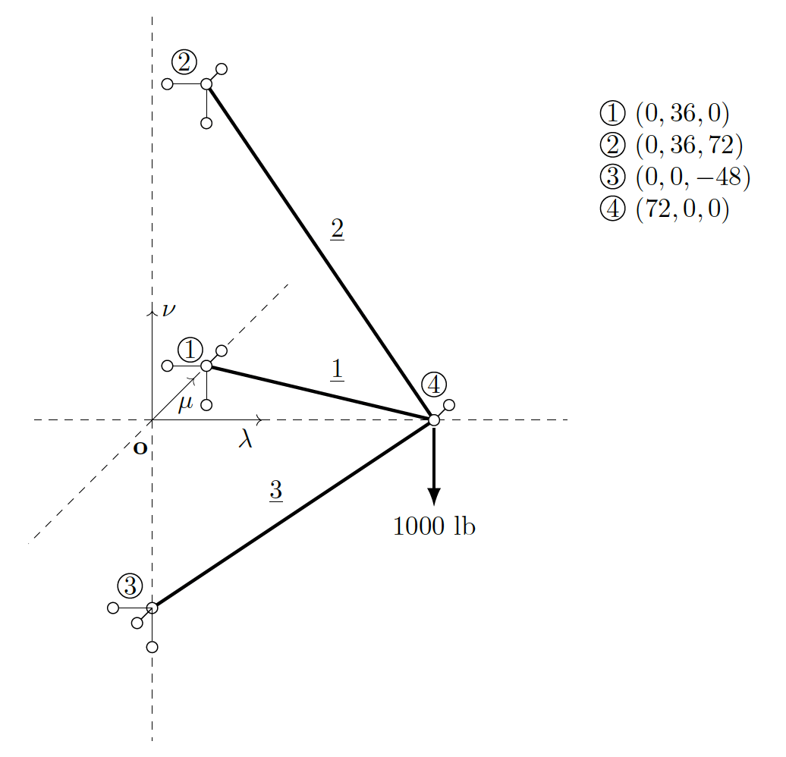
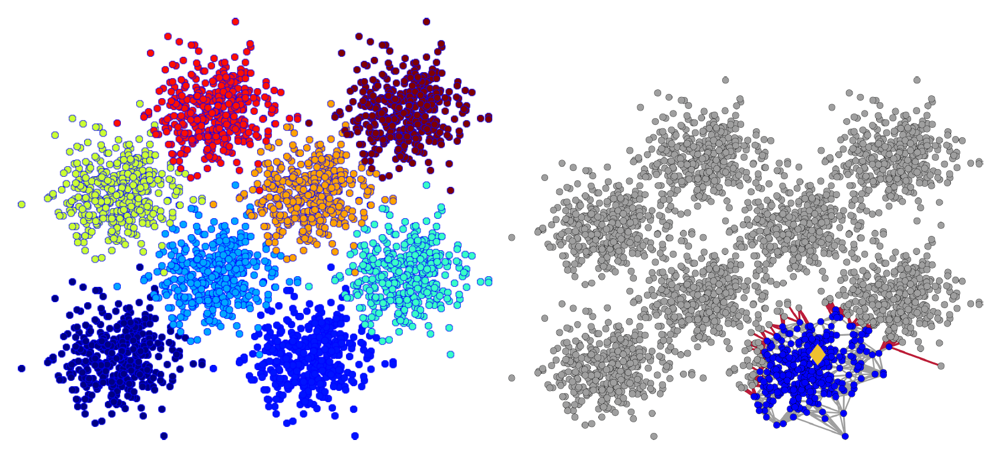

My [doctoral thesis](https://theses.gla.ac.uk/8084/1/2017kodsiphd.pdf) brought together a wide range of diverse topics from fracture mechanics to manifold optimisation and data structures for computational geometry in order to deliver a framework for the fracture of graphite bricks in an AGR core. Below you will find the areas of research that I have expended energy on across the years.

***

## Fracture mechanics

Traditionally, crack propagation is studied from existing cracks. What if the context is moved to V-notches and blunt notches including circular ones? Can we then predict where, when and in what direction a crack will propagate? Do we need more experimental data for this?

These were some of the questions that I pre-occupied myself with during my doctoral thesis. I ended up taking the perspective that crack nucleation appears suddenly as a discrete rupture event at the macroscopic level. This matters because it provides the grounds for taking the (forward) finite difference of the energy release rate relation. A criterion formed by the product of a characteristic length and the critical energy release rate then comes into existence. By considering a specimen with a single-edge crack subject to mode-I loading and employing a bounding argument, an expression for the characteristic length can be derived featuring the usual material strength and toughness parameters. The critical value of the criterion is thus known. How is the criterion to be assessed? Well, the critical value of the criterion is equal to the change in potential energy of a structure following the extension of a finite crack. Treating the extension as a perturbation and applying asymptotic analysis returns an analytical formula that is evaluated at points. Subsequently, where a crack will start from, when it will start and in what direction it will grow can be determined!

There are a number of advantages to the proposed criterion:

* Energy consistent

* Universal in terms of geometry, i.e., applicable to both V-notches and blunt notches

* No need for additional experimental parameters than what is already standard

* Evaluated easily at points following the solution of a problem in a boundary or finite element analysis software

I spent a great deal of time testing the criterion for a whole host of notch geometries. The criterion performed incredibly well. If I ever get the opportunity in the future, I would very much like to explore the criterion further and develop a software for public access. You can see the results along with the theory in the articles:

_Costy Kodsi. "[Crack initiation: A non-local energy approach](https://www.sciencedirect.com/science/article/pii/S0013794416302612)". In: Engineering Fracture Mechanics 165 (2016), pp. 153–182._

_Abolfazl Zahedi, Costy Kodsi, and Filippo Berto. "[Numerical predictions of U-notched sample failure based on a discrete energy argument](https://www.sciencedirect.com/science/article/abs/pii/S016784421830466X)". In: Theoretical and Applied Fracture Mechanics 100 (2019), pp. 298–306._

***

## Discrete BVPs

I remember sitting in a lecture hall as an undergraduate learning about trusses and feeling quite dissatisfied with the lack of a mathematical theory for it all. Who knew I would be developing one many years later! The starting point was the correspondence of a truss with a simple, connected, and weighted graph. Building on this, I was able to develop a suitable graph calculus. The truss problems could then be formally expressed as a discrete boundary value problem. A rigid framework (from combinatorial rigidity) was required as a predicate in order to demonstrate existence and uniqueness of a solution to the problem. 

The problem definition involving rigidity provides a potential pathway for tackling inverse stiffness (being the weights associated with edges) problems. Interestingly, an incidence matrix pre-assembly approach for the system of equations became clear through using graph calculus, which has applications beyond trusses.

Please see the following article for the details:

_Costy Kodsi and Andrey P. Jivkov. "[Boundary Value Problem on a Weighted Graph Relevant to the Static Analysis of Truss Structures](https://doi.org/10.1137/18M1206977)". In: SIAM Journal on Applied Mathematics 81.3 (2021), pp. 1190–1201._

***

## Local graph partitioning

A PageRank vector provides a ranking of vertices that could, for example, be webpages. Sets of vertices can then be assembled according to their order. A discriminating real-valued function can be evaluated for each set to yield the desired outcome and corresponding set. This is the premise of a rather famous local partitioning algorithm in which the PageRank problem is solved for a single starting vertex. I carried out a number of experiments and it is fair to say that the results of the algorithm were not as impressive as the theory. Having come across research on spectral clustering based on the combinatorial p-Laplacian, I was wondering if there was a way somehow that I could modify the PageRank to improve experimental results.

After spending some time looking at the system of linear equations that represent the PageRank problem, I decided that the best course of action would be to pursue a generalisation by replacing the PageRank vector with a vector-valued nonlinear function. The question was then what form should the function take. The derivative of the p-norm of the product of the incidence matrix and a vector served as the inspiration. However, it was the introduction of the Moore-Penrose inverse of the incidence matrix as the first part of the function that provided the magic ingredient. An infinitesimal perturbation (from the linear system) argument was developed to show the potential for improved clustering quality. Thanks to my collaborator, Dimosthenis Pasadakis, a code was developed in MATLAB and a number of experiments were carried out showcasing the capability of the nonlinear modified PageRank Problem in a local partitioning algorithm. The results were stand-out and consistently surpassed state-of-the-art algorithms.

For the theory and experiments, please see:

_Costy Kodsi and Dimosthenis Pasadakis. "[Nonlinear modified PageRank for local graph partitioning](https://arxiv.org/pdf/2409.01834)". In review (2024)._

-> The MATLAB code is available [here](https://github.com/DmsPas/Nonlinear_modified_PageRank).

There are currently two articles in preparation:

* Efficient solution of the Nonlinear modified PageRank problem on large graphs

* Nonlinear PageRank problem applied to directed graphs and clustering quality

The results contained in these papers will be well worth the wait!

***

## Geometry in data science

### Near-geodesics

Computation of geodesics on data manifolds taken to be Euclidean sub-manifolds can be quite expensive in higher-dimensions. There is a price to pay for the Christoffel symbols. But what if we can avoid working with Christoffel symbols altogether? I came up with the concept of near-geodesics that are very cheap to compute and quite close to being a geodesic as long as the local curvature is constant or slowly varying. More on this soon ...

The following is the first article that has come out of this research:

_Alfredo Buttari, Søren Hauberg, and Costy Kodsi. "[Parallel QR Factorization of Block-Tridiagonal Matrices](https://doi.org/10.1137/19M1306166)". In: SIAM Journal on Scientific Computing 42.6 (2020), pp. C313–C334._

### Entropy and the shape of data

This is some really exciting stuff that I have been working on for some time now! More on this soon ...